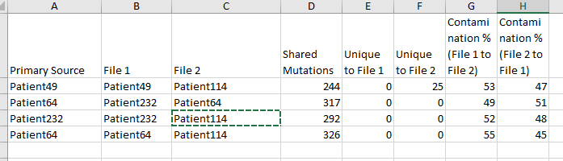

# NGS Contamination Analysis Tool

This project provides a user-friendly graphical interface to analyze contamination between Next-Generation Sequencing (NGS) data files. Users can select multiple CSV files, analyze shared and unique mutations, and determine contamination percentages between samples. The results can be saved as a CSV file.

## Features

- **File Selection**: Select multiple CSV files using a graphical file dialog. (panel --> export --> Select All --> Export as text csv).
- **Automated Analysis**:
  - Calculates shared and unique mutations between pairs of files.
  - Determines contamination percentages based on allele fraction averages.
  - Identifies primary sources of contamination.
- **Results Export**: Save the analysis results as a CSV file 
- **Informational Note**: Results include a note stating they may represent shared sequencing errors.

## Installation

1. Clone the repository:
    ```bash
    git clone https://github.com/yourusername/ngs-contamination-analysis.git
    ```
2. Navigate to the project directory:
    ```bash
    cd ngs-contamination-analysis
    ```
3. Install required dependencies:
    ```bash
    pip install pandas
    ```

## Usage

1. Run the Python script:
    ```bash
    python ngs_analysis_gui.py
    ```
2. Select the CSV files to analyze.
3. Save the results to a desired location.

## Input Requirements

- **File Format**: CSV files with the following assumed structure:
  - Chromosome column: 1st column
  - Position column: 2nd column
  - Allele Fraction column: 22nd column

## Output

- The output file includes the following columns:
  - `Primary Source`: The file determined to be the primary contamination source.
  - `File 1`, `File 2`: The compared file pairs.
  - `Shared Mutations`: Number of shared mutations between the two files.
  - `Unique to File 1`: Mutations unique to the first file.
  - `Unique to File 2`: Mutations unique to the second file.
  - `Contamination % (File 1 to File 2)`: Contamination percentage from File 1 to File 2.
  - `Contamination % (File 2 to File 1)`: Contamination percentage from File 2 to File 1.



## Note

Results are **representative** and may include shared sequencing errors.

## Contributing

Feel free to fork the repository and submit pull requests with improvements or new features.

## License

This project is licensed under the MIT License. See the `LICENSE` file for details.
